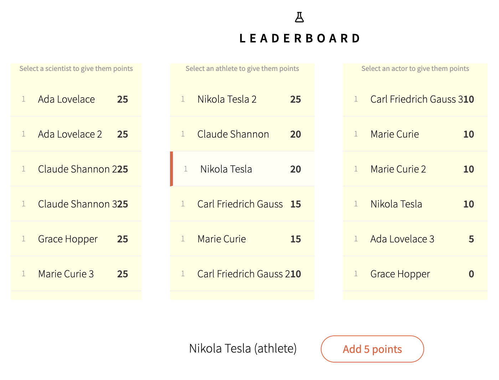

# recruit-challange
We are hiring! 🚀 If you are in our hiring process or considering Harbiz a company in which you would like to work, solve the following challenges and let us know! 😎

## 1. Refactoring (NodeJS)
Refactor the Calendar class and make any changes you see that are usefull to fulfill these requirements:

1. All the tests must pass.
2. The code must fulfil OOP and SOLID principles.
3. The code must be maintainable.
4. The code must be extensible.
5. You must apply defensive programming practices.

See the tests for more information.

## 2. Meteor Componentization (BlazeJS)
Modify this Github repo: https://github.com/meteor/leaderboard to fulfill these requirements:

1. Reusable components.
2. Show 3 horizontal lists (Scientists, Athletes and Actors).
3. The main button should Add 10 points for Scientists, 5 points for Atheletes and 15 points for Actors.

Final result that we expect:

  

